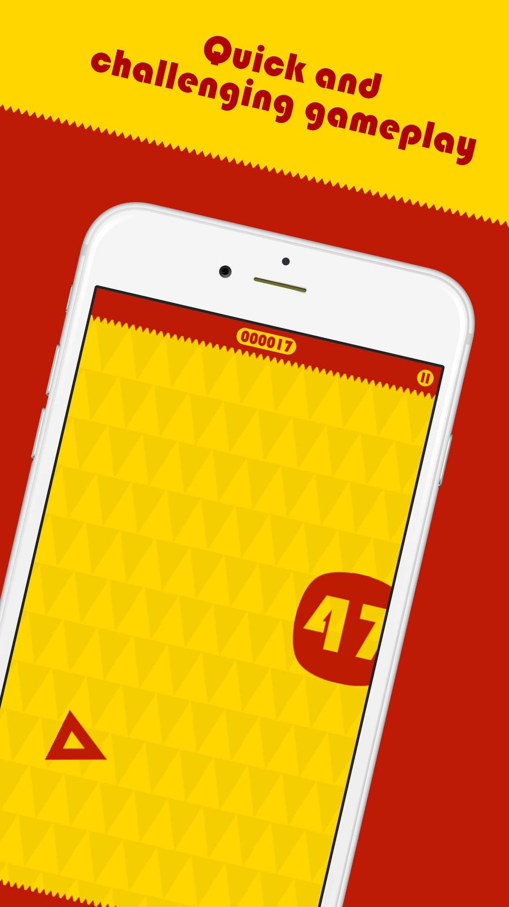

# Gravitational

**The app is discontinued, this repository only serves to archive the code.**

## AppStore Description

Δ This is you.

Have you got both the skill to avoid touching the obstacles and the concentration to solve the tasks and find the correct answer?

Gravitational is a whole new gaming experience combining arcade game elements with brain challenging mental maths. It requires both skill and concentration at the same time. 

Math has never been this much fun.

*Please note that Gravitational is a free download supported by small ad banners. Gravitational has been crafted by a young developer in his free time, so if you wish to support the developer, feel free to get the advertisement-free version via in-app purchase.

## Screenshots

 

 

